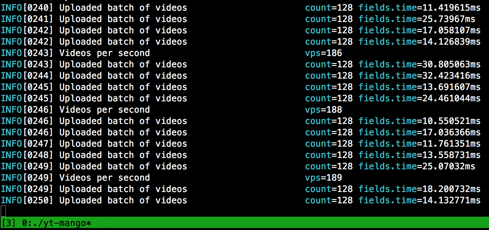

# WIP: yt-mango 💾

> YT metadata extractor inspired by [`youtube-ma` by _CorentinB_][youtube-ma]

##### Build

Install and compile the Go project with `go get github.com/terorie/yt-mango`!

If you don't have a Go toolchain, grab an executable from the Releases tab

##### Worker mode

A special worker mode uses a [Redis](https://redis.io/)
job queue to manage tasks (uncrawled YouTube videos).
The metadata of each video will be uploaded to a central
[Mongo](https://www.mongodb.com/) database afterwards.

While the job queue and DB are central, you can run
as many workers as you want!
Tested scaling up to ~2k video visits per second.

The process basically consists of three steps and gets repeated possibly forever:
 1. Get a random video page from the job queue.
 2. Visit the video page, and extract info (title, description, etc.)
 3. Get the recommended videos on the page and place new ones into the job queue.

This is essentially a distributed
[Breadth-First-Search](https://en.wikipedia.org/wiki/Breadth-first_search)
on the entire YouTube page!

Test it out yourself!
Mac:
```
$ brew install redis mongo
$ brew services launch redis mongo
```

Debian/Ubuntu: (mongodb-org 4.0 recommended!)
```
# apt install redis mongodb
# systemctl start redis
# systemctl start mongodb
```

Then, start yt-mango: 
```
$ yt-mango worker -a json config.yml --first-id 5Erj9y4D3iY
```



By default, yt-mango tries to connect to Redis and Mongo on localhost.
This can be changed using a config file (example in `/example.yml`).

##### Project structure

- _/data_: Data definitions
- _/api_: Shared functions and abstract API definitions
- _/apis_: API implementations
    - _/apiclassic_: HTML API implementation (parsing using [goquery][goquery])
    - _/apijson_: JSON API implementation (parsing using [fastjson][fastjson])
- _/net_: HTTP utilities (async HTTP implementation)
- _/cmd_: [Cobra][cobra] CLI
- _/store_: Queue and database
    - _/store/queue.go_: Redis job queue (using [go-redis][go-redis])
    - _/store/db.go_: Mongo main DB (using [the official Mongo driver][mongodb-driver])
- _/worker_ Worker mode

- _/pretty_: (not yet used) Terminal color utilities

 [youtube-ma]: https://github.com/CorentinB/youtube-ma
 [goquery]: https://github.com/PuerkitoBio/goquery
 [fastjson]: https://github.com/valyala/fastjson
 [cobra]: https://github.com/spf13/cobra
 [viper]: https://github.com/spf13/viper
 [go-redis]: https://github.com/go-redis/redis
 [mongodb-driver]: https://github.com/mongodb/mongo-go-driver
